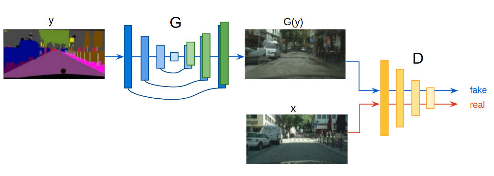
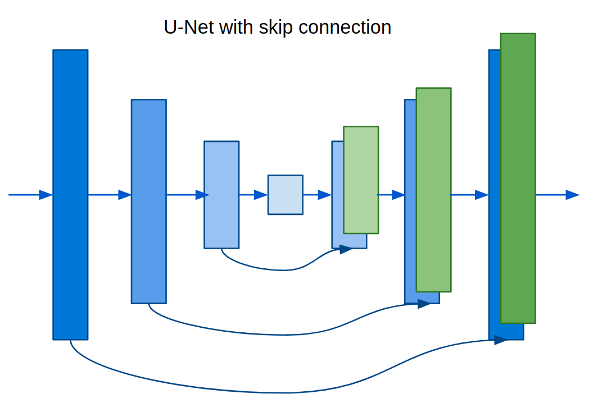
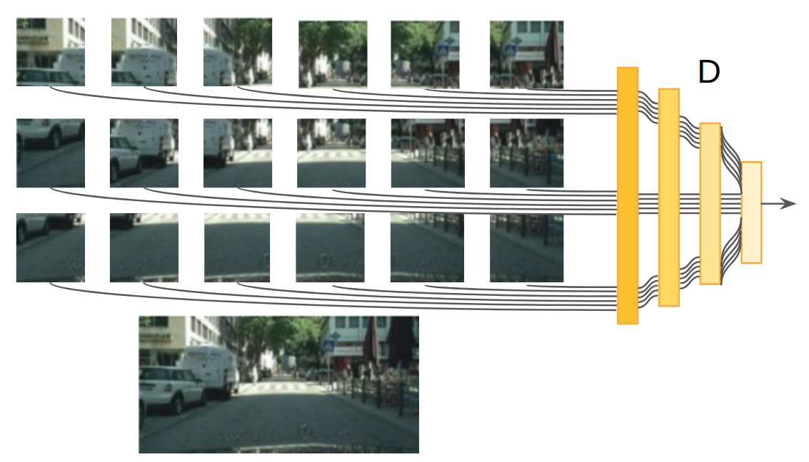
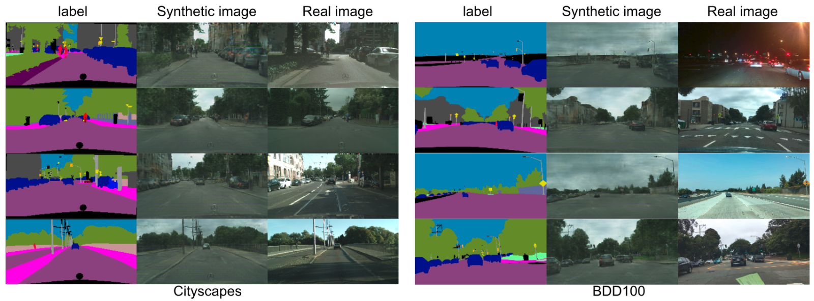
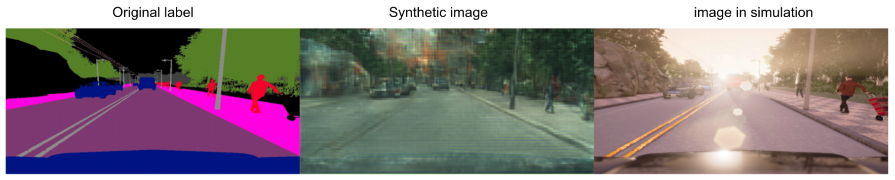
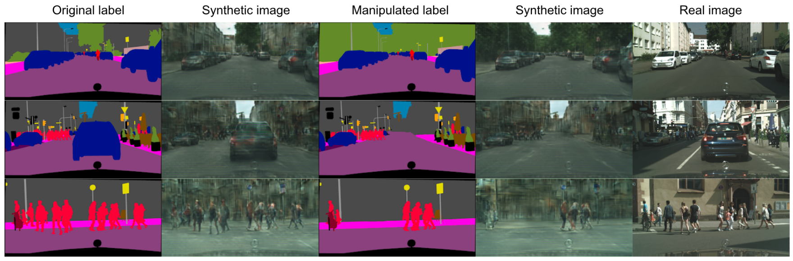

# Pix2Pix-keras
Modified Pix2Pix keras implementation adding perceptual loss.

## Geting Started

## Prerequisites

## Generative Adversarial Networks
Discriminator discriminates whether image is fake or real; generator generates synthetic images
GAN framework learns the loss function for the real image distribution to make the generator images more realistic but still not deterministic mapping
Loss function includes GAN loss, L1 loss and perceptual loss

## Networks Architectures

### Generator with skips
U-Net with skip connection links the layer i in encoder to the layer (n-i) in decoder, to preserve some low-level representation between input and output domain

### PatchGAN
Markovian discriminator, classifies NxN patches and average the classification result for whole image; smaller discriminator and faster training and inference

## Examples

### Cityscapes vs BDD100K

### Cityscapes

### BDD100K

### Simulation scenarios from Carla simulator

### Manipulated scenarios

## References
