# Pix2Pix-keras for realistic driving scenarios synthesis
Keras implementation for learning realistic driving scenario synthesis from semantic label, for example:

The most features implemented in this project are based on the original paper Image-to-Image Translation with Conditional Adversarial Networks
If you are interested in the details, please check the paper

Difference from the original Pix2Pix method:
Adding perceptual loss to enforce the low level representations learning instead of only the "overall" structural similarity from L1 loss
Markovian discriminator extract overlapping patches instead of running convolutionally over whole image to accelerate training and inference

Note: This implementation tries to follow the original Pix2Pix as much as possible. Other difference please check the code implementation.
One of the bottleneck for training is loading data, therefore author converts the dataset firstly to npy to accelerate it.

## Setup

### Prerequisites
Linux (implementation is based on Ubuntu 16.04, have not tested on other os)
NVIDIA GPU
Keras 2.2

### Geting Started
Install all dependencies and setup conda environment by environment.yml file

## Generative Adversarial Networks
Discriminator discriminates whether image is fake or real; generator generates synthetic images
GAN framework learns the loss function for the real image distribution to make the generator images more realistic but still not deterministic mapping
Loss function includes GAN loss, L1 loss and perceptual loss

## Networks Architectures

### Generator with skips
U-Net with skip connection links the layer i in encoder to the layer (n-i) in decoder, to preserve some low-level representation between input and output domain

### PatchGAN
Markovian discriminator, classifies NxN patches and average the classification result for whole image; smaller discriminator and faster training and inference

## Examples

### Cityscapes
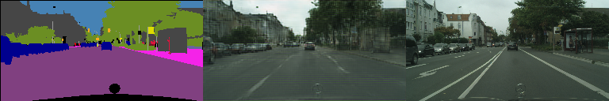
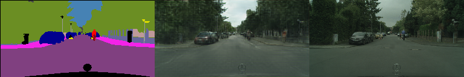
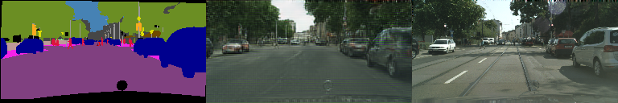
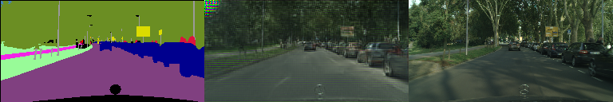
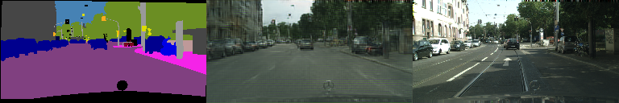
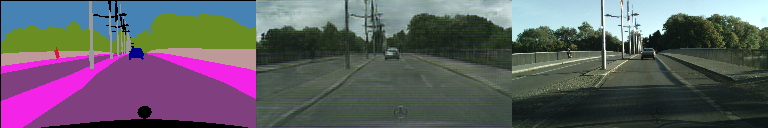
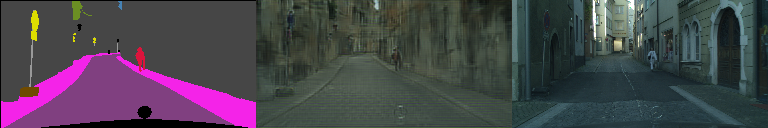
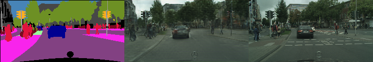
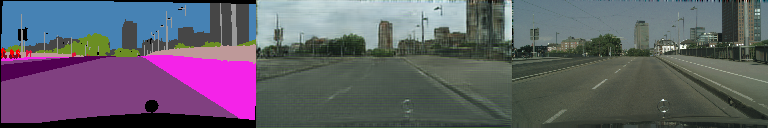
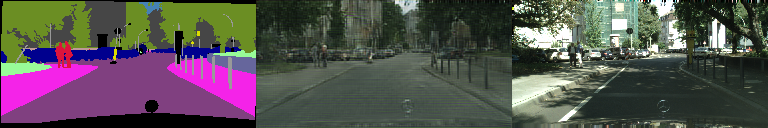
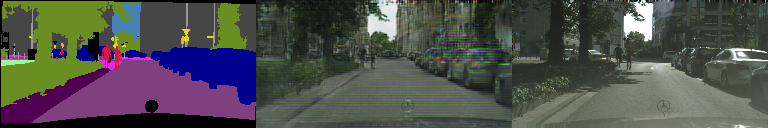
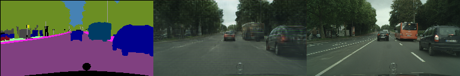
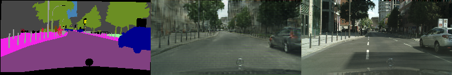
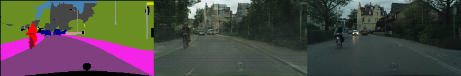
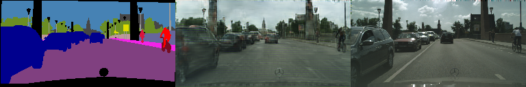

### BDD100K
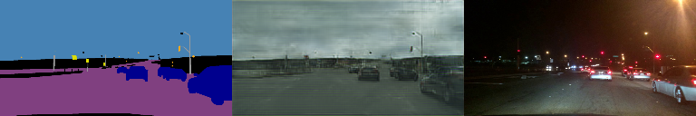
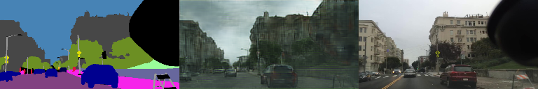
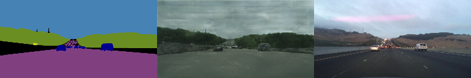
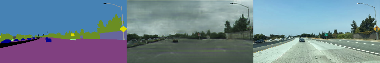
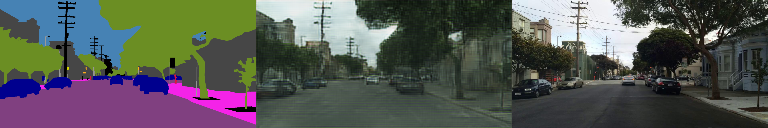
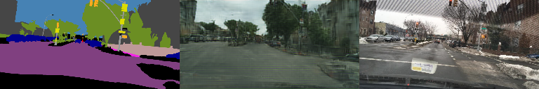
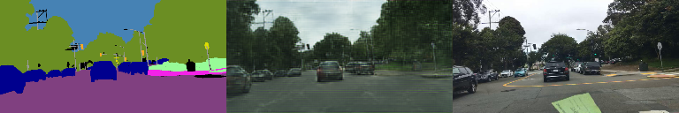
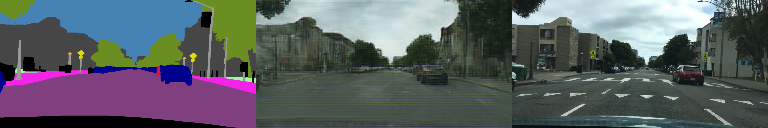

### Simulation scenarios from Carla simulator

### Manipulated scenarios

## References

## Acknowledgments
